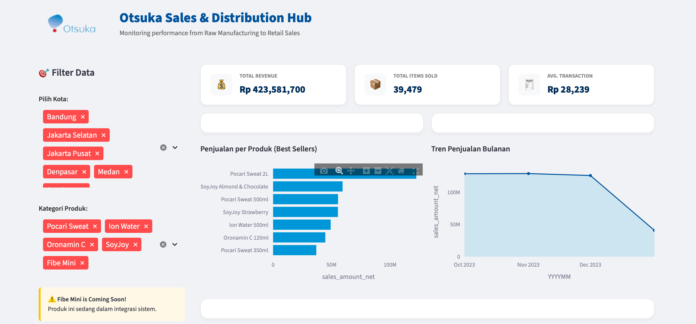
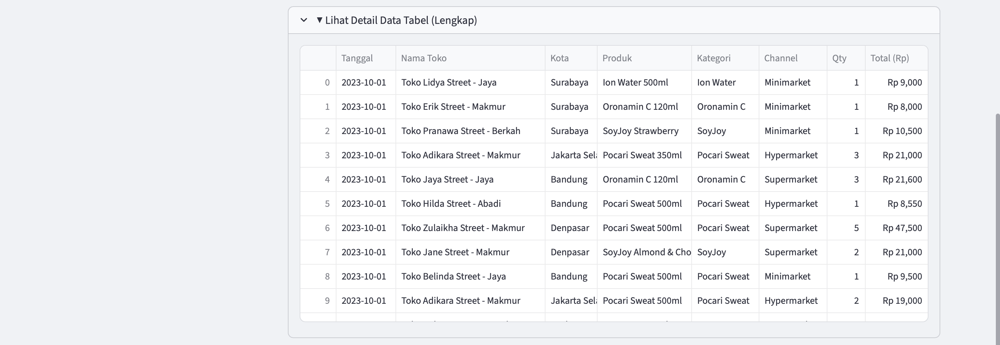

# Otsuka Supply Chain & Sales Analytics Platform (OS-CAP)

**Otsuka Supply Chain & Sales Analytics Platform (OS-CAP)** is an End-to-End Business Intelligence solution designed to simulate the data complexities of an FMCG (Fast Moving Consumer Goods) enterprise. 

<p align="center">
  
</p>

<p align="center">
  
</p>

This project demonstrates a complete Data Engineering pipeline: transforming raw transactional data into actionable strategic insights via a robust **ELT (Extract, Load, Transform)** architecture and a Real-time Dashboard. It is designed as a Proof of Concept (PoC) for scalable analytics suitable for high-volume environments like **PT Amerta Indah Otsuka**.

---

## 🛠 Key Features & Tech Stack

This platform is built using modern software engineering principles and a professional data stack:

*   **Scalable Infrastructure:** Dockerized PostgreSQL 15 Container for isolation and data governance.
*   **Data Warehouse Modeling:** Implementation of **Star Schema** (Fact & Dimensions) to optimize query performance.
*   **Brand Logic Implementation:** Automatic categorization for Otsuka’s product lines (Pocari Sweat, Ion Water, SoyJoy, Oronamin C, Fibe Mini).
*   **Interactive Visualization:** Real-time Dashboard built with **Streamlit** & **Plotly**.
*   **Technologies:** Python 3.10+, Pandas, SQLAlchemy, Docker Compose, Git.

---

## 🚀 How to Run This Project

Follow these steps to set up the environment and run the dashboard from scratch.

### 1. Clone Repository & Environment Setup
First, download the project code and set up the isolated Python environment.

```bash
# Clone this repository
git clone https://github.com/[USERNAME_GITHUB_ANDA]/otsuka-supply-chain-analytics.git

# Enter the project directory
cd otsuka-supply-chain-analytics

# Create and activate Virtual Environment (Mac/Linux)
python3 -m venv venv
source venv/bin/activate

# Install all required dependencies
pip install pandas sqlalchemy psycopg2-binary plotly streamlit watchdog faker
```

### 2. Infrastructure Setup (Docker Database)
We use Docker to spin up a clean PostgreSQL database server.

```bash
# Start the database container in background mode
docker compose up -d

# Verify if the container 'otsuka_db_warehouse' is running
docker ps
```

### 3. Execute ELT Pipeline
Run the Python scripts in order to generate data, ingest it, and transform it into the Data Warehouse.

```bash
# Step A: Generate Mock Data (Simulating ERP Transactions)
python scripts/generate_mock_data.py

# Step B: Ingest Data to Staging (Extract & Load)
python scripts/etl_01_ingest_raw.py

# Step C: Transform to Star Schema (Data Warehousing)
python scripts/etl_02_transform_dwh.py
```

### 4. Launch The Dashboard
Finally, start the Streamlit application to visualize the data.

```bash
# Run the dashboard application
python -m streamlit run dashboard_app.py

The dashboard will automatically open in your default web browser.
```

# 📂 Project Structure

A quick overview of the repository's file organization:

*   dags/: Workflow definitions (future implementation for Airflow).
*   data/: Storage for generated CSV files (Raw simulation data).
*   scripts/: Core Python logic for ETL, Data Generation, and Database connections.
*   sql/: SQL DDL (Data Definition Language) for defining Table Schemas (Source & DWH).
*   docker-compose.yaml: Configuration for infrastructure as code.
*   dashboard_app.py: The entry point for the User Interface/Dashboard.


# 👤 Author

Gina Purnama
Magister Teknik Elektro (Layanan Teknologi Informasi) - Institut Teknologi Bandung

Aspiring Business Intelligence & Data Modeler with a strong background in Service Oriented Architecture and Data Engineering.
